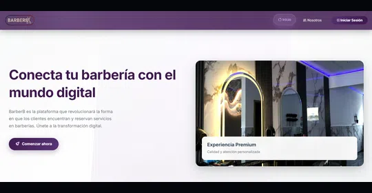

  

 
 

  
  
  
  
  

 

  

 

## 🧠 Perfil profesional

  
  
  

 

Desarrollador de software fullstack y analista de datos con experiencia comprobada en el diseño y construcción de aplicaciones web escalables usando **Python (Django, FastAPI)**, **C# (.NET)** y **APIs REST**.

Lideré end-to-end el desarrollo de un **ERP modular para PYMEs** — arquitectura, modelado de datos, autenticación y despliegue — y en entornos **e-commerce de alto tráfico** he aplicado análisis de datos para evaluar métricas clave de modelos de IA (*accuracy*, *conversion rate*, costos operativos), convirtiendo grandes volúmenes de datos en insights que impactan decisiones de negocio.

Orientado a soluciones mantenibles, con dominio de **Git**, metodologías ágiles y un enfoque constante en la **optimización basada en datos**.

 

  

## 💼 Experiencia

  
  
  

 
<table>
<tr><td width="100%">

### 📊 Data AI Quality Analyst · INTELCIA S.A.S
*Junio 2025 — 2026 · Bogotá, Colombia*

  
  

Validación de datos generados por sistemas de IA en plataformas e-commerce de alto tráfico (**Miravia**, **AliExpress**), procesando miles de interacciones diarias entre sellers y buyers.

<b>🔍 Ver responsabilidades clave</b>

 

- Evaluó métricas clave de modelos de IA (*accuracy*, *conversion rate*, costos operativos), identificando patrones y oportunidades de mejora en modelos de chat y sistemas de recomendación.
- Desarrolló reportes estructurados y análisis estratégicos que respaldaron decisiones del equipo de producto.
- Automatizó limpieza y transformación de datos con funciones avanzadas y macros de Excel, reduciendo tiempos operativos.
- Aplicó metodología **CRISP-DM** en procesos de análisis end-to-end.
- Monitoreó KPIs mediante dashboards internos para el control de calidad de los sistemas de IA.

**Stack:** 

</td></tr>
<tr><td width="100%">

### ⚙️ Backend Developer Jr (Prácticas) · Koop Technology
*Octubre 2025 — Abril 2026*

  
  

Desarrollo y mantenimiento de APIs REST en producción con FastAPI, integradas a un frontend en React.

<b>🔍 Ver responsabilidades clave</b>

 

- Implementó lógica de negocio, validaciones robustas y endpoints escalables orientados a producción.
- Diseñó y optimizó consultas SQL y modelado relacional, aplicando ORMs para eficiencia y mantenibilidad.
- Integró servicios backend con el frontend en React asegurando comunicación confiable vía APIs bien definidas.
- Participó activamente en pull requests, revisiones de código y ceremonias ágiles.

**Stack:** 

</td></tr>
<tr><td width="100%">

### 🧩 Full Stack Developer (Freelance) · Proyecto BarberB — Tecnoparque
*Abril 2024 — Julio 2025*

  
  

Diseño e implementación de un ERP modular para barberías y PYMEs, desde la arquitectura hasta el despliegue en producción.

<b>🔍 Ver responsabilidades clave</b>

 

- Arquitecturó el backend en Django aplicando *clean architecture* y separación de responsabilidades.
- Implementó autenticación/autorización con flujos personalizados de recuperación de contraseña.
- Modeló y optimizó la base de datos en MySQL con gestión de roles y permisos para múltiples tipos de usuario.
- Desarrolló un dashboard administrativo con indicadores en tiempo real mediante AJAX.
- Lideró decisiones técnicas, documentación y planificación del producto.
- Desplegó la solución en infraestructura cloud (**GCP**).

**Stack:** 

</td></tr>
</table>

 

## ⚙️ Stack tecnológico

### 📊 Data & Analytics

### 🚀 Backend & Fullstack

### 🛠️ Herramientas & Cloud

 

## 📊 GitHub Stats

 

 

 
<picture>
<source media="(prefers-color-scheme: dark)" srcset="https://raw.githubusercontent.com/MikeBoss80/MikeBoss80/output/github-contribution-grid-snake-dark.svg">

</picture>
 

 

## 🚀 Proyectos destacados

  
    
  
<i>Proyectos destacados — arrastra o usa las flechas para explorar</i>

 

  

 

 

## 🎓 Certificaciones

  

 

## 🗣️ Idiomas & Soft Skills

### 🌍 Idiomas

### 💪 Soft Skills

 

## 🤝 Colaboración

Interesado en proyectos relacionados con:

- 🔧 Backend para sistemas empresariales
- ⚙️ Automatización de procesos
- 📊 BI y analítica aplicada a negocio
- 🌐 Open source en herramientas de datos o backend
- 💡 Productos digitales con impacto real

  

  

 

  

